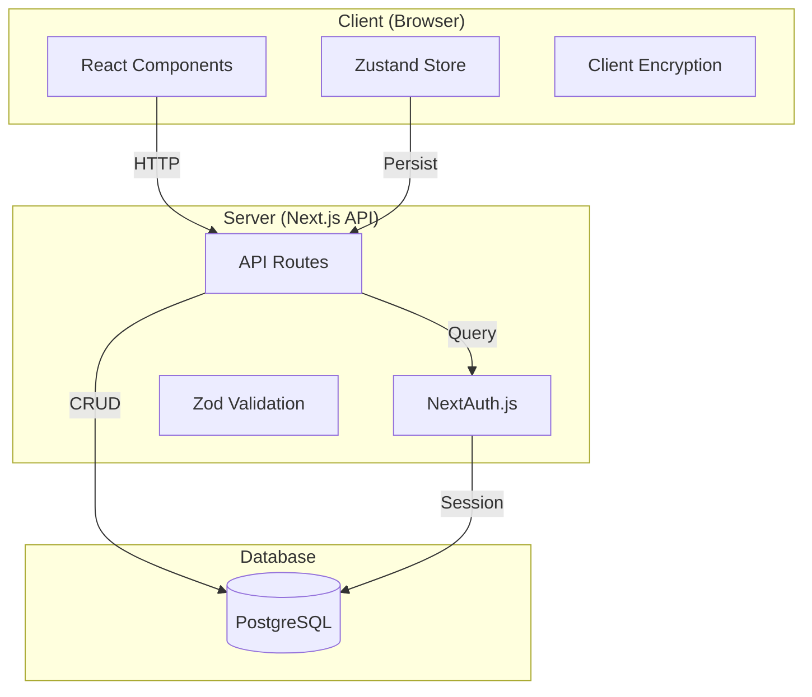

# TOKN - Development Roadmap to Vercel Deployment

## Current Application State

The TOKN app is a **Next.js 16** application for API token management with the following characteristics:

### ✅ Completed Features

- Landing page with Hero, Features, and CTA sections
- Dashboard for token management (view, copy, delete)
- Token parser to scan text for API keys
- Client-side encryption/decryption (demo quality)
- Activity logging system
- Export to .env and JSON formats
- Dark/light theme switching
- Zustand state management with localStorage persistence

### ⚠️ Incomplete / Needs Work

- **No database schema** - Prisma installed but no schema file
- **Demo authentication** - Login/register only works locally
- **Weak encryption** - XOR-based demo encryption, not production-safe
- **No API persistence** - All data stored in browser localStorage only
- **No tests** - No unit, integration, or E2E tests
- **No CI/CD** - No automated deployment pipeline

---

## Architecture Overview



---

## Phase 1: Database & Backend Foundation

| Task                 | Description                                                       |
| -------------------- | ----------------------------------------------------------------- |
| Create Prisma schema | Define User, Token, Activity models with relationships            |
| Configure database   | Set up PostgreSQL connection (Neon or Vercel Storage recommended) |
| Environment config   | Create `.env.example` with all required variables                 |
| Verify connection    | Test database connectivity                                        |

### Recommended Prisma Schema Structure

```prisma
model User {
  id        String   @id @default(cuid())
  email     String   @unique
  name      String?
  password  String
  tokens    Token[]
  activities Activity[]
  createdAt DateTime @default(now())
  updatedAt DateTime @updatedAt
}

model Token {
  id          String   @id @default(cuid())
  service     String
  token       String   // Encrypted
  description String?
  category    String
  status      TokenStatus
  userId      String
  user        User     @relation(fields: [userId], references: [id])
  createdAt   DateTime @default(now())
  updatedAt   DateTime @updatedAt
}

model Activity {
  id        String   @id @default(cuid())
  action    String
  service   String
  details   String?
  userId    String
  user      User     @relation(fields: [userId], references: [id])
  timestamp DateTime @default(now())
}

enum TokenStatus {
  ACTIVE
  EXPIRED
  EXPIRING
}
```

---

## Phase 2: Authentication System

| Task               | Description                                 |
| ------------------ | ------------------------------------------- |
| Configure NextAuth | Set up credentials provider with PostgreSQL |
| Password hashing   | Add bcrypt for secure password storage      |
| Session management | Implement JWT sessions                      |
| Auth UI            | Create login/register forms                 |
| Connect store      | Update Zustand store to use real auth       |

---

## Phase 3: Security & Encryption

| Task                   | Description                                        |
| ---------------------- | -------------------------------------------------- |
| Replace encryption     | Use AES-256-GCM instead of XOR                     |
| Key derivation         | Implement PBKDF2 with salt                         |
| Server-side encryption | Encrypt on server, decrypt only when needed        |
| Env validation         | Validate required environment variables at startup |

### Recommended Encryption Flow

```
1. User enters token
2. Send to server (over HTTPS)
3. Server encrypts with AES-256-GCM using master key
4. Store encrypted token in database
5. When user requests token:
   - Server retrieves encrypted token
   - Decrypts with master key
   - Returns to client (never store decrypted)
```

---

## Phase 4: API Routes & Data Persistence

| Task             | Description                                   |
| ---------------- | --------------------------------------------- |
| Token CRUD       | Create `/api/tokens` endpoints                |
| Activity logging | Create `/api/activities` endpoints            |
| User isolation   | Ensure users can only access their own tokens |
| Input validation | Add Zod schemas for all inputs                |
| Error handling   | Create centralized error handling             |

### Recommended API Endpoints

```
POST   /api/auth/register    - Register new user
POST   /api/auth/login       - Login user
POST   /api/auth/logout     - Logout user
GET    /api/tokens           - List user's tokens
POST   /api/tokens           - Create new token
PATCH  /api/tokens/[id]      - Update token
DELETE /api/tokens/[id]      - Delete token
GET    /api/activities       - Get user's activity log
```

---

## Phase 5: Frontend Integration

| Task               | Description                         |
| ------------------ | ----------------------------------- |
| Connect dashboard  | Replace localStorage with API calls |
| Connect parser     | Save parsed tokens to database      |
| Loading states     | Add skeletons and spinners          |
| Error handling     | Show user-friendly error messages   |
| Optimistic updates | Update UI before server response    |

---

## Phase 6: Testing & Quality Assurance

| Task              | Description                   |
| ----------------- | ----------------------------- |
| Unit tests        | Test utilities, components    |
| Integration tests | Test API routes               |
| E2E tests         | Test critical user flows      |
| ESLint            | Fix linting errors            |
| TypeScript        | Fix type errors               |
| Build check       | Ensure production build works |

---

## Phase 7: Vercel Deployment Prep

| Task               | Description                                 |
| ------------------ | ------------------------------------------- |
| Environment vars   | Configure all required env vars in Vercel   |
| Database setup     | Provision PostgreSQL (Neon recommended)     |
| Prisma config      | Update for production connection            |
| Vercel config      | Create `vercel.json` if needed              |
| GitHub integration | Connect repository for auto-deploys         |
| Production build   | Test build locally with production settings |

### Required Environment Variables

```
DATABASE_URL=postgresql://...
NEXTAUTH_SECRET=your-secret-key
NEXTAUTH_URL=https://your-app.vercel.app
ENCRYPTION_KEY=your-256-bit-key
```

---

## Phase 8: Production Deployment

| Task        | Description                       |
| ----------- | --------------------------------- |
| Deploy      | Push to Vercel production         |
| Migrate     | Run database migrations           |
| Test auth   | Verify login/register works       |
| Test tokens | Verify token CRUD works           |
| Monitoring  | Enable Vercel Analytics           |
| Domain      | Configure custom domain if needed |

---

## Phase 9: Post-Deployment

| Task          | Description                     |
| ------------- | ------------------------------- |
| CI/CD         | Set up GitHub Actions for tests |
| Backups       | Configure database backups      |
| Documentation | Document API and features       |
| Maintenance   | Plan for updates and fixes      |

---

## Recommended Tech Stack for Production

| Category   | Technology                                             |
| ---------- | ------------------------------------------------------ |
| Database   | **Neon** (PostgreSQL, free tier) or **Vercel Storage** |
| Auth       | **NextAuth.js** with credentials provider              |
| Encryption | **Web Crypto API** (AES-256-GCM)                       |
| Validation | **Zod**                                                |
| Testing    | **Vitest** + **Playwright**                            |
| Hosting    | **Vercel**                                             |

---

## Priority Order

1. **Immediate**: Create Prisma schema and database connection
2. **High**: Implement proper authentication
3. **High**: Replace demo encryption with production encryption
4. **Medium**: Create API routes and connect frontend
5. **Medium**: Add tests before deployment
6. **Low**: Documentation and monitoring

---

_Generated: February 2026_
